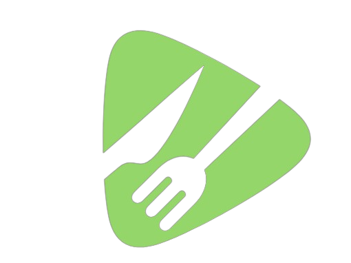

<!-- Title and Logo -->

  

<h1 align="center">LOKALISTA</h1>

Your Local Food Recommender

<!-- Shields -->

  

## Description

LOKALISTA is a Streamlit-based web application that helps users find local produce based on their budget. It provides recommendations for local food items and allows users to save their shopping list to Notion.

## Features

- **Local Produce Selection:** Users can select categories of local produce they are interested in.
- **Budget Input:** Users can input their budget to filter recommendations based on affordability.
- **Recommended Items:** The app provides a list of recommended local produce items within the specified budget.
- **Notion Integration:** Users can save their shopping list directly to Notion for easy access.

## Usage

To run the app locally, follow these steps:

1. Clone this repository to your local machine.
2. Install the required dependencies using `pip install -r requirements.txt`.
3. Create a `.env` file in the root directory of the project and add your Notion API token.
4. Run the Streamlit app using `streamlit run lokalista.py`.
5. Access the app in your browser at `http://localhost:8501`.

## Dependencies

- streamlit
- pandas
- streamlit-extras
- streamlit-gsheets
- streamlit-scrollable-textbox
- python-dotenv
- notion

## Developers

- Mark De Chavez
- Watson Dongon
- Allen Macaspac
- Angela Samboa

InnOlympics Hackathon 2024

